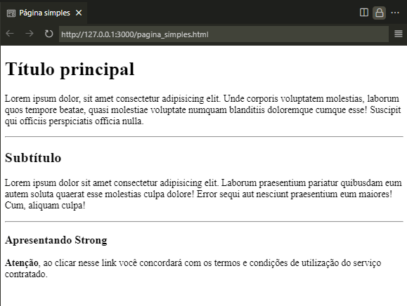

# Página simples - Tags em HTML e suas funcionalidades

Adicionando alguns projetos e aprendizagens que estou desenvolvendo na faculdade de Análise e Desenvolvimento de Sistemas da Estácio. Aqui mostro um pouco sobre como criar uma página simples! 

Criando uma [página simples](#página-simples) para aprender sobre cada tag aprensentada em aula

#### ```<!doctype html>```
> Informa ao navegador que este é um arquivo HTML e qual a sua versão;

#### ```<html>```
> Abrange todos os elementos da página;

#### ```<head>```
> Cabeçalho do página;

#### ```<title>```
> Título da página;

#### ```<body>```
> Corpo do site. onde ficará o conteúdo;

#### ```<h1>```
> Marcação de título do conteúdo, a referência 1 indicada pelo "Primeiro" tipo de tamanho de texto e suas variantes que podem ser representadas desde &lt;h1&gt; até &lt;h6&gt;. Assim como visto em &lt;h2&gt; usado para o subtítulo do conteúdo e a tag &lt;h3&gt; usada para apresentar a tag &lt;strong&gt; no [código principal](https://github.com/Felipe-Tamura/Pagina_simples/blob/main/pagina_simples.html);

#### ```<p>```
> Marcação de páragrafo do conteúdo.

#### ```<strong>```
> Deixa a marcação do texto mais "forte".

Com estas tags conseguimos apresentar conteúdos de artigos, noticias, livros, receitas, blogs, etc.

***OBS: Estou explicando cada funcionalidade das tags que estou utilizando com a descrição sobre como foi usado neste repositório, para mais detalhes sobre estas tags veja o site [mdn web doc](https://developer.mozilla.org/pt-BR/docs/Web/HTML).***

## Página simples

<p align="center">
    
</p>
